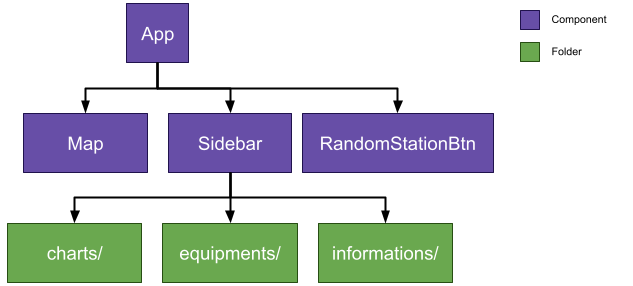
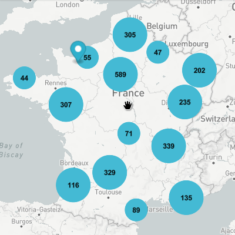
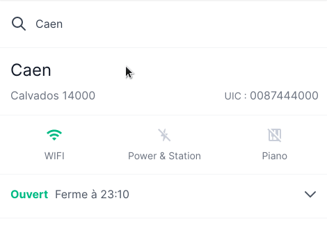
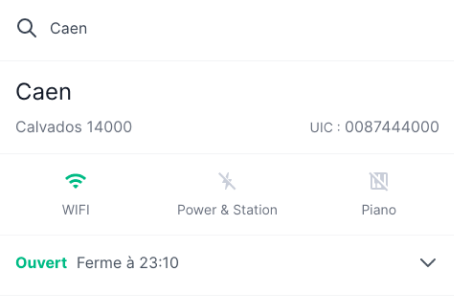
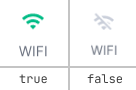
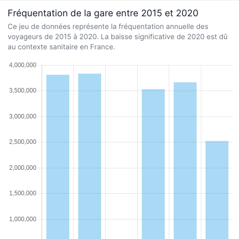

<!-- PROJECT LOGO -->
<div align="center"">
    
</div> 

<h3 align="center">Projet IHM - Visualisation des données</h3>

<!-- TABLE OF CONTENTS -->
<details>
<summary>Table des matières</summary>
<ol>
    <li>
        <a href="#install">Guide d'installation et d'exécution</a>
    </li>
    <li>
        <a href="#about">Description du projet</a>
    </li>
    <li>
        <a href="#components">Les composants principaux</a>
        <ul>
            <li>
                <a href="#map">Map</a>
            </li>
            <li>
                <a href="#sidebar">Sidebar</a>
            </li>
            <li>
                <a href="#random">RandomStationBtn</a>
            </li>
            <li>
                <a href="#equipments">Equipments</a>
            </li>
            <li>
                <a href="#charts">Charts</a>
            </li>
        </ul>
    </li>
</ol>
</details>

<!-- INSTALL -->
## Guide d'installation et d'exécution

Premièrement, il faut récupérer le code source de l'application : 

```sh
git clone https://github.com/Benlemt/sncf-project.git
```


Une fois le code téléchargé sur votre machine, il faut installer les dépendances :

```shell
npm install 
```

Nous pouvons dès maintenant lancer l'application en compilant le code : 

```shell
npm run serve
```

## Description du projet

Le but premier de cette application est d'en apprendre plus sur les gares de voyageurs en France.

L'utilisateur est capable de visualiser où se situent les différentes gares sur une carte. L'application indique si la 
gare est équipée **WiFi**, de station **Power & Station** (__des vélos qui rechargent les appareils électroniques__), ou 
d'un **piano**. Enfin l'application propose de visualiser quatres indicateurs qui sont : 

- La **fréquentation annuelle** de la gare de 2015 à 2020.
- Le **taux de conformité de la propreté** en gare
- Les **raisons de déplacements** des voyageurs au sein de la gare
- Les **lieux de destinations** possibles avec le **prix** associé d'un billet simple, ou l'abonnement mensuel, s'il existe.

Enfin, l'application propose de sélectionner une gare au hasard dans la France afin d'en apprendre plus.

## Les composants principaux 

<p align="center">
    
</p>

Ce schéma explique brièvement la logique de nos composants d'un point de vue hiérarchique. Premièrement, nous trouvons
le composant père. Il s'agit du composant `App.vue`. De ce composant hérite trois composants enfants :

- `Map.vue` : organise la logique de la carte. Affiche les gares et gère les actions de l'utilisateur comme le clic sur un point de la carte.
- `Sidebar.vue` : permet d'organiser la vue des différents graphiques de l'application. Ce composant propose une barre de recherche pour l'utilisateur.
- `RandomStationBtn.vue` : permet d'obtenir une gare au hasard


Enfin, nous avons représenté en vert sur le schéma, les trois dossiers dans lesquels nous avons plusieurs composants.
Nous avons donc trois grandes familles :

- `charts/` : ce dossier contient les composants qui sont des graphiques (graphiques en bâton, en ligne ou en donuts).
- `equipments/` : ce dossier contient les composants qui indique si la gare est équipée de la WiFi, de Power & Station, ou d'un piano.
- `informations/` : ce dossier contient les composants qui donnent des informations présentées autrement que sous la forme d'un graphique (un tableau par exemple). 


### Map

Le composant `Map.vue` permet de gérer la carte de l'application. Celle-ci permet à l'utilisateur de visualiser où se
situent les gares en France. Il peut aussi cliquer sur un point qui représente une gare pour en apprendre plus sur
cette dernière. Nous avons choisi d'utiliser [Mapbox](https://www.mapbox.com/) pour la partie cartographie. 

<p align="center">
    
</p>

### Sidebar

Le composant `Sidebar` joue deux rôles. Premièrement il présente les différents graphiques/informations de la gare
sélectionnée. Deuxièmement, il propose à l'utilisateur un formulaire de recherche pour rechercher une gare par nom. 

<p align="center">
    
</p>

### RandomStationBtn

Ce composant reprèsente un bouton qui permet à l'utilisateur à découvrir une station de gare au hasard dans toute la
France. Une fois que l'utilisateur clique dessus, les informations de la `Map` et de la `Sidebar` se mettent à jour automatiquement.

<p align="center">
    
</p>

### Equipments

<p align="center">
    
</p>

Il s'agit en réalité de trois composants : `Wifi.vue`, `Charger.vue` et `Piano.vue`. Ils permettent d'afficher des
informations booléennes comme nous pouvons le voir sur l'image suivante. À gauche, cela signifie que la gare possède des
bornes WiFi et à droite l'inverse.

<p align="center">
    
</p>

### Charts 

Il s'agit ici de trois composants :

- `Cleanliness.vue` : affiche un graphique en bâton sur le taux de conformité de la propreté. Ce graphique comporte un code couleur qui indique si la gare possède un problème de propreté.
- `ReasonsChart.vue` : affiche un graphique en donuts sur les différentes raisons de déplacements des voyageurs.
- `TrafficChart.vue` : affiche deux types de graphique (en bâton et en ligne) sur la fréquentation annuelle d'une gare.

<p align="center">
    
</p>
